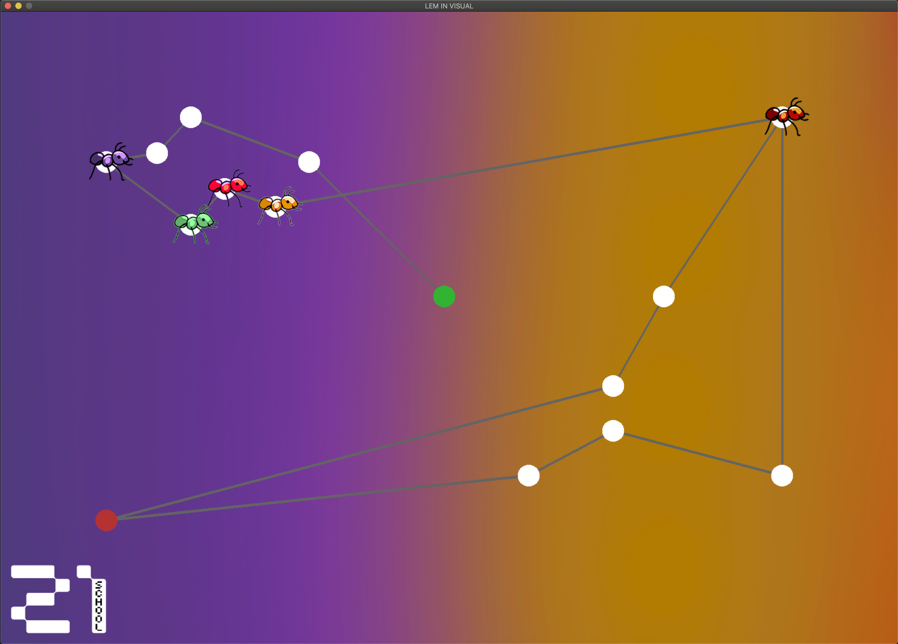

# LEM-IN

### :white_square_button: ***About***

Lem-in is a project of ***School 42***. The aim of that project is to find the best path in digital ant farm. The program receives the data that includes the number of ants, coordinates, room names and links.
The standard output displays all the information about the ant farm and after that the solution.

As a bonus, visualization of the algorithm was made on the SDL library.

### :white_square_button: ***Grade***

***Score 125/125***
```
Mandatory part 100/100

Bonus part 25/25
```

***Example****
```console
➜  maps git:(master) cat map2.1
10
##start
start 0 2
0 0 0
1 2 0
2 2 2
3 4 0
##end
end 4 2
start-0
start-1
start-2
0-1
0-2
1-2
1-3
1-end
2-3
2-end
3-end%
```
***Solution****
```console
➜  len git:(master) ✗ ./lem-in < visual/maps/map2.1 
10
##start
start 0 2
0 0 0
1 2 0
2 2 2
3 4 0
##end
end 4 2
start-0
start-1
start-2
0-1
0-2
1-2
1-3
1-end
2-3
2-end
3-end

L1-2 L2-1
L1-end L2-end L3-2 L4-1
L3-end L4-end L5-2 L6-1
L5-end L6-end L7-2 L8-1
L7-end L8-end L9-2 L10-1
L9-end L10-end
```

